# images

## sombre

```Bash
./sombre-1.sh 2015-07-08_comparison_of_mu_of_selection_mujets.png
```

|**original**                                                   |**processed**                                                         |
|---------------------------------------------------------------|----------------------------------------------------------------------|
|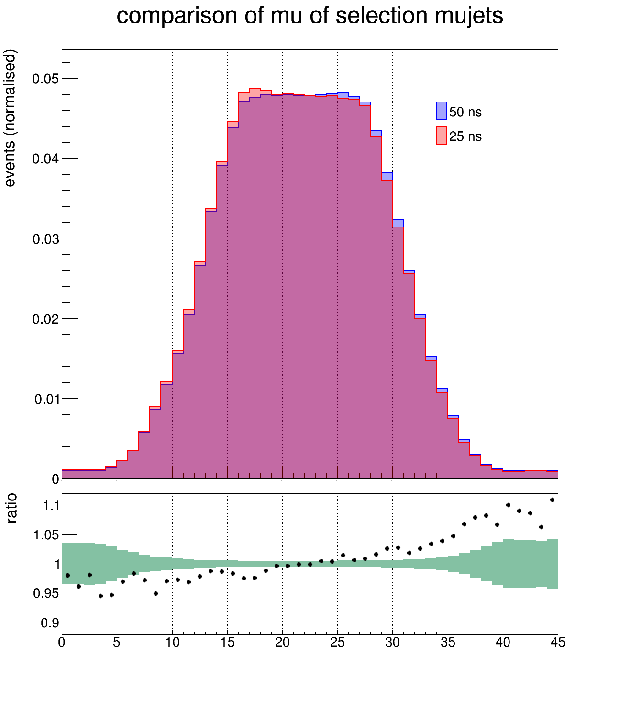|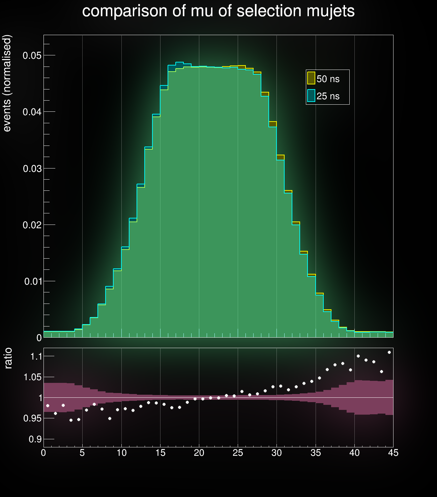|

```Bash
./sombre-2.sh 2014-04-10_2.png
```

|**original**                |**processed**                      |
|----------------------------|-----------------------------------|
|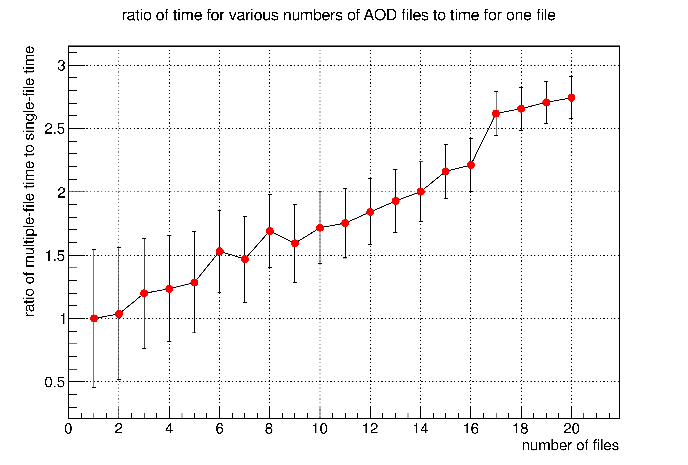|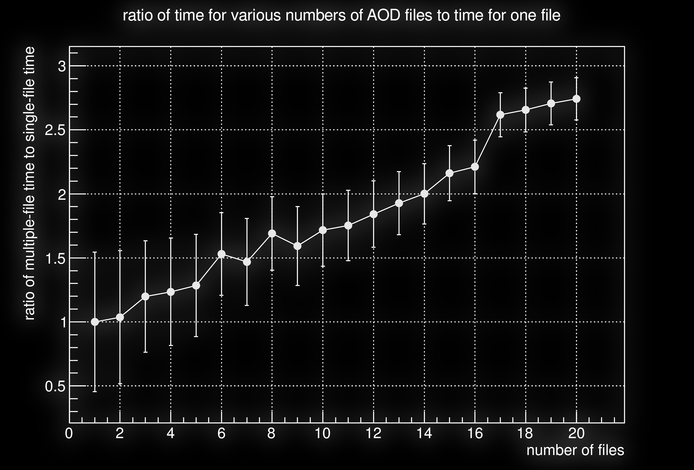|

## VT

R1 beer time:

```Bash
bash <(curl -sL http://cern.ch/go/Qv8F)
```

## LaTeX

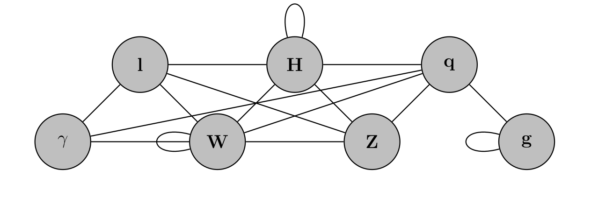
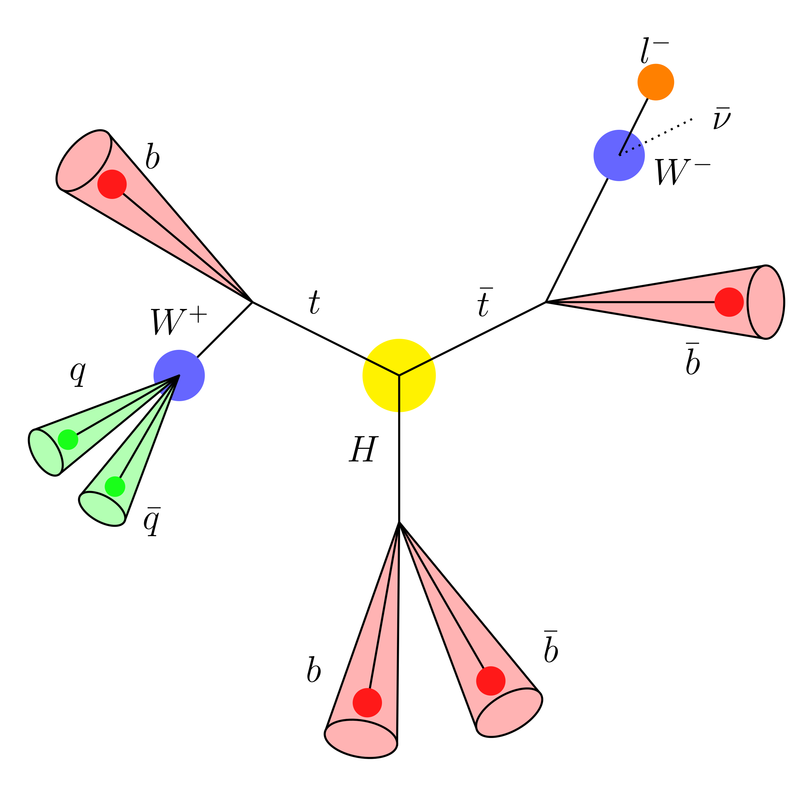
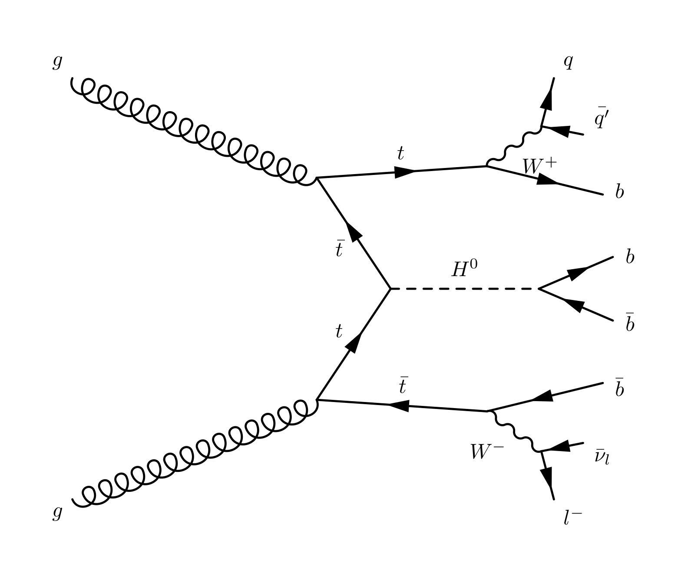
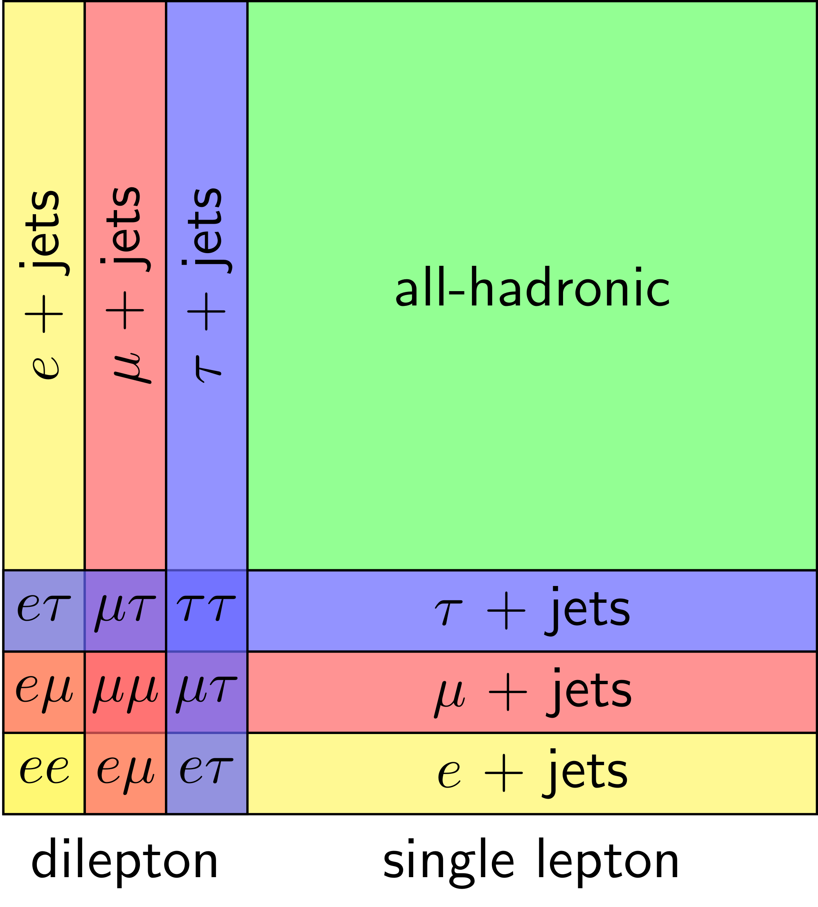
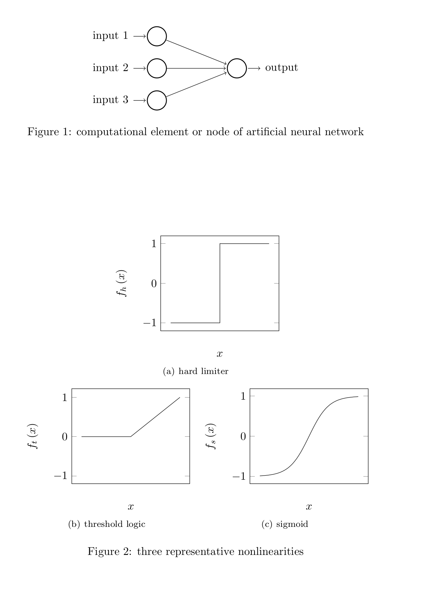
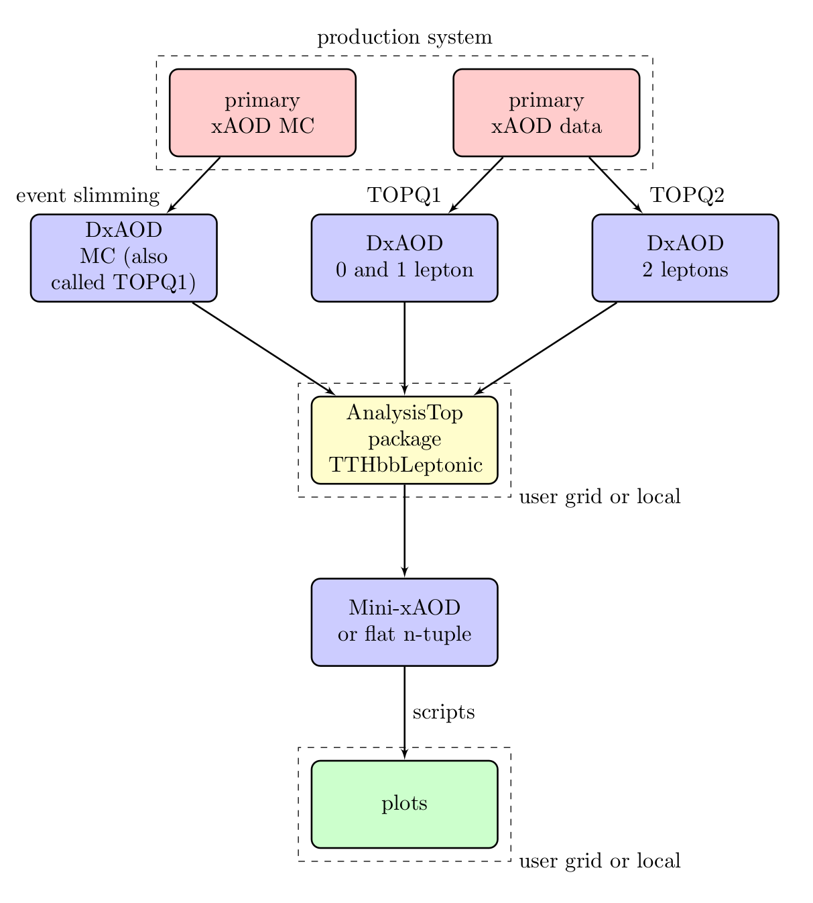
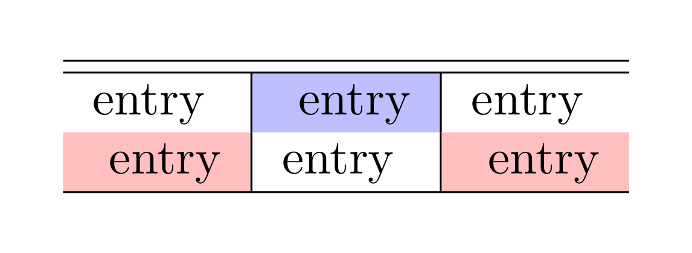

